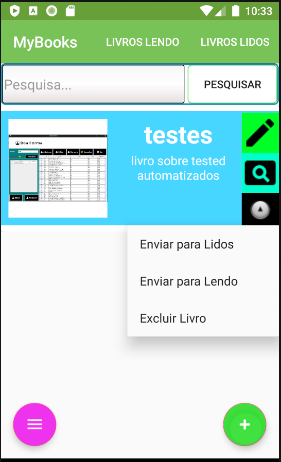

# Projeto Mybook

Esse projeto se baseia na criação de um aplicativo que gerencie livros,
permitindo também que o usuario possa criar,alterar, excluir e mover o livro estre as categorias(Lidos,Lendo)
dentro do aplicativo.

## Como usar?

Para instalar o aplicativo use [releases](https://github.com/gilberto-009199/MyBooks/releases) e baixe o .apk no android

### Pre-requisitos Dependencias

* Para instalar o .apk o modo desenvolvedor deve estar ativo
* Para instalar o .apk o android deve ter acesso a internet

## Bibliotecas

* [ROOM](https://developer.android.com/topic/libraries/architecture/room) - ORM para usar o SQLite do android
* [designer](https://developer.android.com/design/) - Biblioteca para o desenvolvimento Visual do Aplicativo

